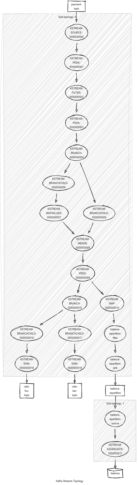

# Spring Boot application demonstrating usage of the Kafka Streams

## This repo accompanies the following series of articles on Kafka Streams:

- [Kafka Streams: Introduction](https://medium.com/lydtech-consulting/kafka-streams-introduction-d7e5421feb1b)
- [Kafka Streams: Spring Boot Demo](https://medium.com/lydtech-consulting/kafka-streams-spring-boot-demo-ff0e74e08c9c)
- [Kafka Streams: Testing](https://medium.com/lydtech-consulting/kafka-streams-testing-f263f216808f)

## Visualiser la topology :

### Copier coller le résultat de l'API GET sur ce site afin de visualiser la topology en ligne : [online](https://zz85.github.io/kafka-streams-viz/#VG9wb2xvZ2llczoKICAgU3ViLXRvcG9sb2d5OiAwCiAgICBTb3VyY2U6IEtTVFJFQU0tU09VUkNFLTAwMDAwMDAwMDAgKHRvcGljczogW3N0cmVhbXMtcGxhaW50ZXh0LWlucHV0XSkKICAgICAgLS0+IEtTVFJFQU0tRkxBVE1BUFZBTFVFUy0wMDAwMDAwMDAxCiAgICBQcm9jZXNzb3I6IEtTVFJFQU0tRkxBVE1BUFZBTFVFUy0wMDAwMDAwMDAxIChzdG9yZXM6IFtdKQogICAgICAtLT4gS1NUUkVBTS1LRVktU0VMRUNULTAwMDAwMDAwMDIKICAgICAgPC0tIEtTVFJFQU0tU09VUkNFLTAwMDAwMDAwMDAKICAgIFByb2Nlc3NvcjogS1NUUkVBTS1LRVktU0VMRUNULTAwMDAwMDAwMDIgKHN0b3JlczogW10pCiAgICAgIC0tPiBLU1RSRUFNLUZJTFRFUi0wMDAwMDAwMDA2CiAgICAgIDwtLSBLU1RSRUFNLUZMQVRNQVBWQUxVRVMtMDAwMDAwMDAwMQogICAgUHJvY2Vzc29yOiBLU1RSRUFNLUZJTFRFUi0wMDAwMDAwMDA2IChzdG9yZXM6IFtdKQogICAgICAtLT4gS1NUUkVBTS1TSU5LLTAwMDAwMDAwMDUKICAgICAgPC0tIEtTVFJFQU0tS0VZLVNFTEVDVC0wMDAwMDAwMDAyCiAgICBTaW5rOiBLU1RSRUFNLVNJTkstMDAwMDAwMDAwNSAodG9waWM6IEtTVFJFQU0tQUdHUkVHQVRFLVNUQVRFLVNUT1JFLTAwMDAwMDAwMDMtcmVwYXJ0aXRpb24pCiAgICAgIDwtLSBLU1RSRUFNLUZJTFRFUi0wMDAwMDAwMDA2CgogIFN1Yi10b3BvbG9neTogMQogICAgU291cmNlOiBLU1RSRUFNLVNPVVJDRS0wMDAwMDAwMDA3ICh0b3BpY3M6IFtLU1RSRUFNLUFHR1JFR0FURS1TVEFURS1TVE9SRS0wMDAwMDAwMDAzLXJlcGFydGl0aW9uXSkKICAgICAgLS0+IEtTVFJFQU0tQUdHUkVHQVRFLTAwMDAwMDAwMDQKICAgIFByb2Nlc3NvcjogS1NUUkVBTS1BR0dSRUdBVEUtMDAwMDAwMDAwNCAoc3RvcmVzOiBbS1NUUkVBTS1BR0dSRUdBVEUtU1RBVEUtU1RPUkUtMDAwMDAwMDAwM10pCiAgICAgIC0tPiBLVEFCTEUtVE9TVFJFQU0tMDAwMDAwMDAwOAogICAgICA8LS0gS1NUUkVBTS1TT1VSQ0UtMDAwMDAwMDAwNwogICAgUHJvY2Vzc29yOiBLVEFCTEUtVE9TVFJFQU0tMDAwMDAwMDAwOCAoc3RvcmVzOiBbXSkKICAgICAgLS0+IEtTVFJFQU0tU0lOSy0wMDAwMDAwMDA5CiAgICAgIDwtLSBLU1RSRUFNLUFHR1JFR0FURS0wMDAwMDAwMDA0CiAgICBTaW5rOiBLU1RSRUFNLVNJTkstMDAwMDAwMDAwOSAodG9waWM6IHN0cmVhbXMtd29yZGNvdW50LW91dHB1dCkKICAgICAgPC0tIEtUQUJMRS1UT1NUUkVBTS0wMDAwMDAwMDA4Cgo=)
Topologies:
   Sub-topology: 0
    Source: KSTREAM-SOURCE-0000000000 (topics: [payment-topic])
      --> KSTREAM-PEEK-0000000001
    Processor: KSTREAM-PEEK-0000000001 (stores: [])
      --> KSTREAM-FILTER-0000000002
      <-- KSTREAM-SOURCE-0000000000
    Processor: KSTREAM-FILTER-0000000002 (stores: [])
      --> KSTREAM-PEEK-0000000003
      <-- KSTREAM-PEEK-0000000001
    Processor: KSTREAM-PEEK-0000000003 (stores: [])
      --> KSTREAM-BRANCH-0000000004
      <-- KSTREAM-FILTER-0000000002
    Processor: KSTREAM-BRANCH-0000000004 (stores: [])
      --> KSTREAM-BRANCHCHILD-0000000006, KSTREAM-BRANCHCHILD-0000000005
      <-- KSTREAM-PEEK-0000000003
    Processor: KSTREAM-BRANCHCHILD-0000000006 (stores: [])
      --> KSTREAM-MAPVALUES-0000000007
      <-- KSTREAM-BRANCH-0000000004
    Processor: KSTREAM-BRANCHCHILD-0000000005 (stores: [])
      --> KSTREAM-MERGE-0000000008
      <-- KSTREAM-BRANCH-0000000004
    Processor: KSTREAM-MAPVALUES-0000000007 (stores: [])
      --> KSTREAM-MERGE-0000000008
      <-- KSTREAM-BRANCHCHILD-0000000006
    Processor: KSTREAM-MERGE-0000000008 (stores: [])
      --> KSTREAM-PEEK-0000000009
      <-- KSTREAM-BRANCHCHILD-0000000005, KSTREAM-MAPVALUES-0000000007
    Processor: KSTREAM-PEEK-0000000009 (stores: [])
      --> KSTREAM-BRANCH-0000000015, KSTREAM-MAP-0000000010
      <-- KSTREAM-MERGE-0000000008
    Processor: KSTREAM-BRANCH-0000000015 (stores: [])
      --> KSTREAM-BRANCHCHILD-0000000016, KSTREAM-BRANCHCHILD-0000000017
      <-- KSTREAM-PEEK-0000000009
    Processor: KSTREAM-MAP-0000000010 (stores: [])
      --> balance-repartition-filter
      <-- KSTREAM-PEEK-0000000009
    Processor: KSTREAM-BRANCHCHILD-0000000016 (stores: [])
      --> KSTREAM-SINK-0000000018
      <-- KSTREAM-BRANCH-0000000015
    Processor: KSTREAM-BRANCHCHILD-0000000017 (stores: [])
      --> KSTREAM-SINK-0000000019
      <-- KSTREAM-BRANCH-0000000015
    Processor: balance-repartition-filter (stores: [])
      --> balance-repartition-sink
      <-- KSTREAM-MAP-0000000010
    Sink: KSTREAM-SINK-0000000018 (topic: rails-foo-topic)
      <-- KSTREAM-BRANCHCHILD-0000000016
    Sink: KSTREAM-SINK-0000000019 (topic: rails-bar-topic)
      <-- KSTREAM-BRANCHCHILD-0000000017
    Sink: balance-repartition-sink (topic: balance-repartition)
      <-- balance-repartition-filter

  Sub-topology: 1
    Source: balance-repartition-source (topics: [balance-repartition])
      --> KSTREAM-AGGREGATE-0000000011
    Processor: KSTREAM-AGGREGATE-0000000011 (stores: [balance])
      --> none
      <-- balance-repartition-source

